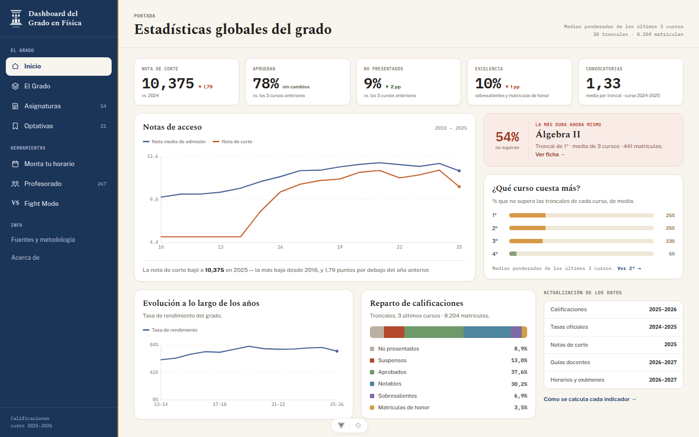
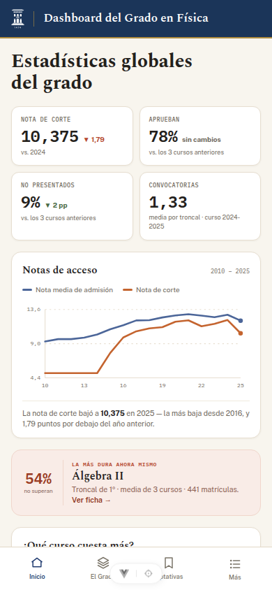

# Dashboard del Grado en Física

Estadísticas del Grado en Física de la Universidad de Zaragoza, a partir de los
datos oficiales que publica la propia Universidad.

**🔗 [aaleta.github.io/unizar_dashboard](https://aaleta.github.io/unizar_dashboard/)**

<p align="center">
  
</p>

---

## Índice

- [Por qué existe](#por-qué-existe)
- [Qué hay dentro](#qué-hay-dentro)
- [Fuente de los datos](#fuente-de-los-datos)
- [Móvil y escritorio](#móvil-y-escritorio)
- [Instalarla como aplicación](#instalarla-como-aplicación)
- [Para desarrolladores](#para-desarrolladores)
- [Mejoras y contribuciones](#mejoras-y-contribuciones)
- [Contacto](#contacto)
- [Licencia](#licencia)

---

## Por qué

Hasta ahora elegir asignaturas se hacía a base de rumores de pasillo o acosando
al tutor: que si una optativa es imposible, que si es muy fácil, 
que si tal curso es el que de verdad cuesta, etc. Los números para
comprobarlo siempre han existido (la Universidad los publica) pero están repartidos en
hojas de cálculo, informes y páginas distintas, y nadie se pone a cruzarlos
antes de matricularse.

Esta web hace ese trabajo: los mismos datos oficiales,
ordenados y comparables, para que decidir el curso que viene sea un poco más
fácil.

- **Los datos son los que son.** No se redondea, no se estima y no se "mejora"
  ninguna cifra al pintarla. Cada indicador se calcula en un único sitio y con
  la nomenclatura oficial de Unizar, y en **Fuentes y metodología** se explica
  con qué denominador.
- **Esto no juzga a nadie.** Una tasa alta de no superación describe un
  resultado, no la calidad de una asignatura, ni la de quien la imparte,
  ni la de quien la cursa.

Desarrollado como Prácticas Externas en el
[Instituto de Biocomputación y Física de Sistemas Complejos (BIFI)](https://bifi.es/).

## Fuente de los datos

| Conjunto | Origen |
|---|---|
| Calificaciones | [estudios.unizar.es — resultados académicos](https://estudios.unizar.es/informe/resultados-academicos?estudio_id=20250124) |
| Tasas oficiales | [Zaguan — datos abiertos de rendimiento](https://zaguan.unizar.es/collection/opendata-academico-rendimiento-asignatura-titulacion?ln=en) |
| Profesorado y guías docentes | [estudios.unizar.es](https://estudios.unizar.es/) |
| Horarios y fechas de examen | [Publicación oficial del centro](http://155.210.84.118/publicacion/2627) |

Todo esto está también dentro de la web, en **"Fuentes y metodología"**.

**Importante:** cada conjunto se actualiza por su cuenta y no todos van al
mismo día. La web solo deja seleccionar los cursos para los que existen datos,
y la fecha de actualización de cada conjunto se ve en la página de inicio.

## Móvil y escritorio

La web funciona igual en el móvil y en el ordenador. Es **un único código base
responsive**, no dos versiones de la aplicación. La mayoría de las pantallas
son la misma a distinto ancho.

La única que cambia de verdad es la red de profesorado: en el móvil se recorre
persona a persona, y en escritorio se dibuja el grafo completo de 
profesores, que en una pantalla de teléfono no se puede ni leer ni manejar fácilmente.

<p align="center">
  
</p>

## Instalarla como aplicación

Se puede "descargar" tanto desde el móvil como desde el ordenador. No es una
descarga tradicional, sino un acceso directo que hace que la web se comporte
visualmente como una aplicación, aunque siga funcionando en el navegador.

**En el móvil** suele aparecer un aviso la primera vez. Si no aparece, hay que
pulsar los tres puntos de la esquina superior derecha del navegador y elegir
**"Instalar y crear acceso directo"**.

<p align="center">
  
</p>

Después se pregunta si se quiere instalar la aplicación o crear un acceso
directo. La diferencia es que, instalada, no se ve la barra del navegador. Las
dos opciones funcionan igual, aunque se recomienda la instalación.

**En el ordenador** basta con pulsar el icono de instalación que aparece en la
barra de direcciones.

## Para desarrolladores

El código es una aplicación estática de Vue 3 + Vite; los datos se generan con
un script de Python y viajan dentro del propio bundle. Para levantarla:

```sh
cd web
npm install
npm run dev
```

Abre la URL que imprime Vite (incluye la ruta base `/unizar_dashboard/`).

La documentación completa está en `docs/`:

- **[docs/DEVELOPER_GUIDE.md](docs/DEVELOPER_GUIDE.md)** — cómo está montado el
  proyecto, cómo ejecutarlo en local, cómo se actualizan los datos y cómo se
  publica.
- **[docs/DESIGN.md](docs/DESIGN.md)** — el sistema de diseño: contrato de
  color, tipografía, primitivas y reglas de accesibilidad. Léelo antes de tocar
  cualquier pantalla.

## Mejoras y contribuciones

Siempre se pueden añadir funcionalidades nuevas o corregir errores que hayan
pasado desapercibidos.

Si detectas un fallo o se te ocurre una mejora,
[abre un issue](https://github.com/aaleta/unizar_dashboard/issues) o escríbenos.
Y como el código es abierto, también puedes contribuir directamente con un
*pull request*.

## Contacto

Alberto Aleta
Departamento de Física Teórica, Facultad de Ciencias, Universidad de Zaragoza
Instituto de Biocomputación y Física de Sistemas Complejos, Universidad de Zaragoza
[aaleta@unizar.es](mailto:aaleta@unizar.es)

## Licencia

[MIT](LICENSE). Los datos originales pertenecen a la Universidad de Zaragoza y
se publican aquí tal y como ella los publica.
</content>
