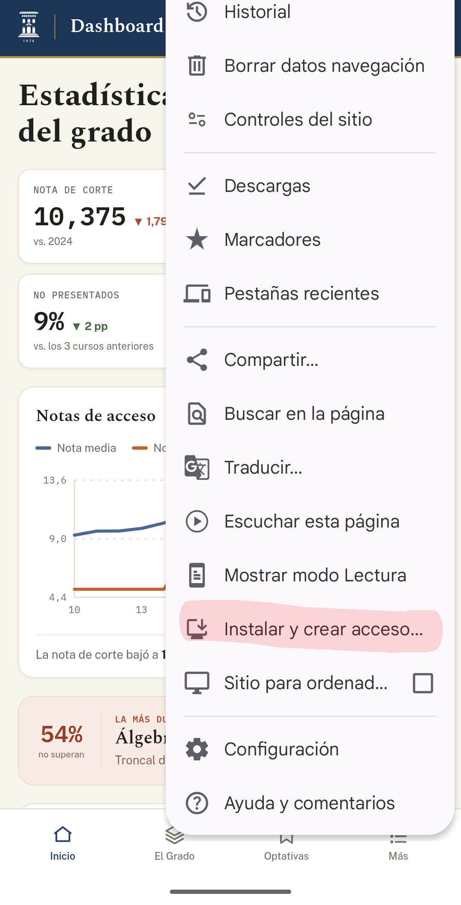

# Unizar Dashboard

Estadísticas del Grado en Física de la Universidad de Zaragoza.

## Fuente de los datos

* **Notas**: https://estudios.unizar.es/informe/resultados-academicos?estudio_id=20250124
* **Resultados**: https://zaguan.unizar.es/collection/opendata-academico-rendimiento-asignatura-titulacion?ln=en
* **Profesores y guías docentes**: https://estudios.unizar.es/
* **Horarios y fechas de examen**: http://155.210.84.118/publicacion/2627

Se puede acceder a esta información desde la propia web, en el apartado **"Fuentes y metodología"**.

**Importante:** `notas.xlsx` está algo desactualizado. La web solo permite seleccionar los cursos para los que existen datos. La fecha de actualización de cada conjunto de datos puede consultarse en la página de inicio.

## Móvil-Desktop

La web está disponible tanto para dispositivos móviles como para ordenadores. Algunas funciones dependen del dispositivo desde el que se acceda (por ejemplo, la red de profesores solo está disponible en modo escritorio). Aparte de eso, las diferencias son únicamente visuales.

Se trata de **un único código base responsive**, no de dos versiones diferentes de la aplicación.

## Descarga

Es posible "descargar" la web tanto desde el móvil como desde el ordenador. No se trata de una descarga tradicional, sino de la creación de un acceso directo que hace que la web se comporte visualmente como una aplicación, aunque sigue funcionando a través del navegador.

*Para descargarla:*

En el móvil normalmente aparece un mensaje al acceder por primera vez. Si no aparece, hay que pulsar los tres puntos situados en la esquina superior derecha del navegador y seleccionar **"Instalar y crear acceso directo"**.

  

Después se preguntará si se desea instalar la aplicación o crear un acceso directo. La diferencia es que, al instalarla, no se muestra la barra del navegador, mientras que con el acceso directo sí. En cualquier caso, ambas opciones funcionan prácticamente igual, aunque se recomienda la instalación para obtener una experiencia más similar a la de una aplicación.

En el ordenador basta con pulsar el icono de instalación que aparece en la barra de direcciones del navegador.

## Más información

Para obtener más información, consulta los apartados **"Acerca de"** y **"Fuentes y metodología"**, disponibles dentro de la sección **"Más"** de la web.

## Mejoras y actualizaciones

Siempre es posible añadir nuevas funcionalidades y características al proyecto, así como corregir posibles errores o *bugs* que hayan pasado desapercibidos.

Por ello, animamos a cualquier persona que detecte un error o tenga ideas para mejorar el proyecto a que las comunique a los creadores. Asimismo, dado que el código es *open source*, cualquiera puede contribuir directamente mediante un *pull request* incorporando nuevas funcionalidades o corrigiendo las existentes.

